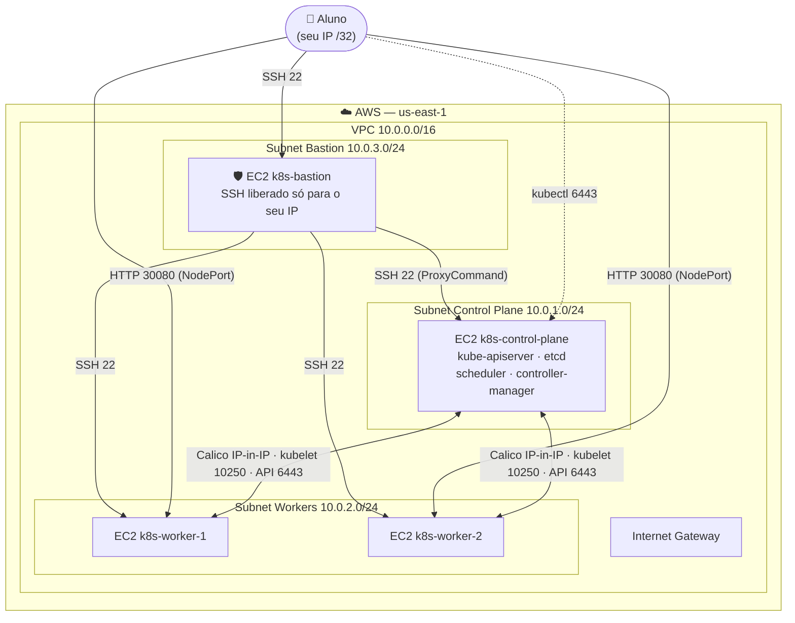
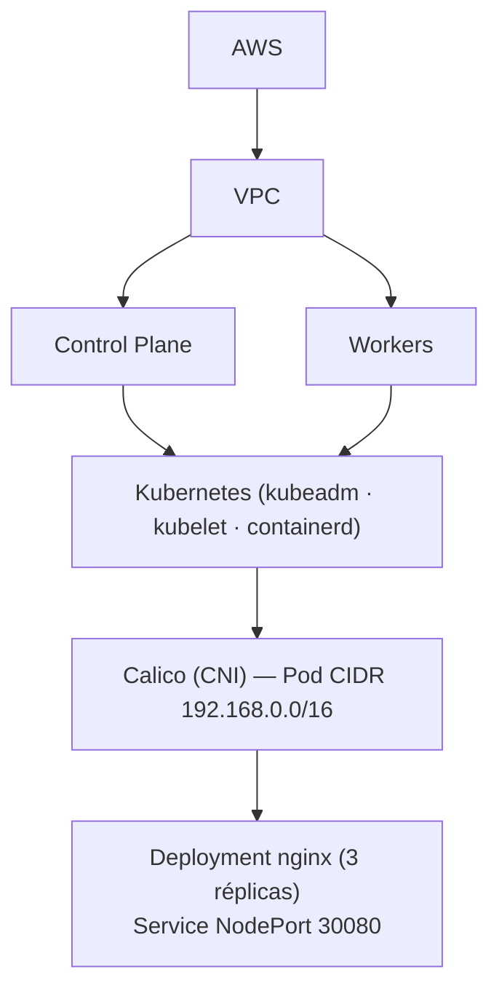
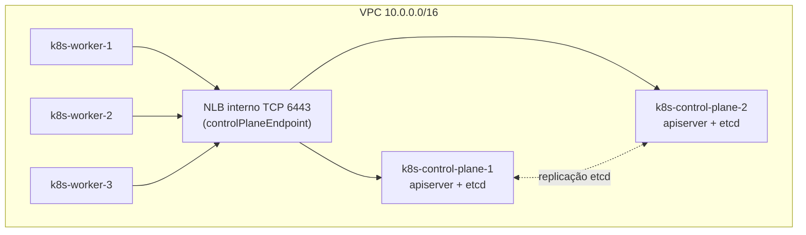

# Diagrama da arquitetura

## Infraestrutura AWS (modo padrão: 1 Control Plane + 2 Workers + Bastion)

## Camadas do cluster

## Fluxo de provisionamento (Extras 1 e 2)

```mermaid
flowchart LR
    A["terraform apply"] --> B["VPC · Subnets · IGW · Route Table"]
    B --> C["Security Groups"]
    C --> D["EC2: Bastion · Control Plane · Workers"]
    D --> E["templatefile() → ansible/inventory.ini"]
    E --> F["terraform_data + local-exec<br/>ansible-playbook site.yml"]
    F --> G["common → containerd → kubernetes"]
    G --> H["kubeadm init + Calico"]
    H --> I["kubeadm join (workers)"]
    I --> J["NGINX + teste do NodePort"]
```

## Modo HA (Extra 4: 2 Control Planes + 3 Workers)

Todos os kubelets e o `kubectl` dos Control Planes falam com a API pelo DNS do NLB, então
qualquer API Server pode atender. O etcd fica "empilhado" (stacked) em cada Control Plane.
